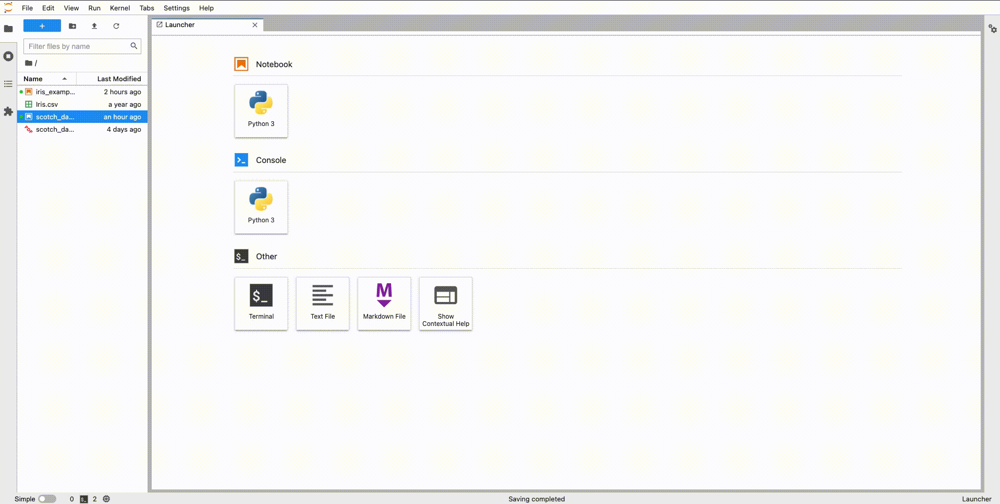

# voila-gridstack

A gridstack-based template for [](https://github.com/voila-dashboards/voila).

<table>
<thead align="center" cellspacing="10">
  <tr>
    <th align="center" border="">Gitter channel</th>
    <th align="center" border="">Voila</th>
    <th align="center" border="">JupyterLab extension</th>
  </tr>
</thead>
<tbody>
  <tr background="#FFF">
    <td align="center">
      <a href="https://gitter.im/QuantStack/Lobby?utm_source=badge&utm_medium=badge&utm_campaign=pr-badge&utm_content=badge">
        
      </a>
    </td>
    <td align="center">
      <a href="https://mybinder.org/v2/gh/voila-dashboards/voila-gridstack/stable?urlpath=voila/tree/examples/scotch_dashboard.ipynb">
        
      </a>
    </td>
    <td align="center">
      <a href="https://mybinder.org/v2/gh/voila-dashboards/voila-gridstack/stable?urlpath=lab/tree/examples">
        
      </a>
    </td>
  </tr>
</tbody>
</table>

## Installation

`voila-gridstack` can be installed with the mamba package manager

```
mamba install -c conda-forge voila-gridstack
```

or from PyPI

```
pip install voila-gridstack
```

## Format

The template uses metadata defined in the notebook file (`.ipynb`) to configure the layout.
The specification of the metadata was defined by a now defunct project `jupyter-dashboards`.
The specification is described in `jupyter-dashboards`
[docs](https://jupyter-dashboards-layout.readthedocs.io/en/latest/metadata.html).

The voila renderer behaves as a "display-only renderer without authoring capabilitiy" as defined in
the specs. However, there are a few differences compared to the original implmentation:

- if no metadata is found in the notebook voilà will render the notebook as `grid` layout,
- it can not persist the state of the cells (i.e. the re-configuration of the layout will
  be lost, when the user closes the voila page),
- if the cell does not contain view configuration for the particular view type (`grid` or
  `report`) or `hidden` attribute is not defined, voilà will treat it as **visible**.

## Usage

To use the `gridstack` template, pass option `--template=gridstack` to the `voila` command line.


By default the position of cells in the dashboard will be fixed. If you want them to be draggable
and resizable, you can launch voila with the `show_handles` resource set to `True`:

```
voila --template=gridstack examples/ --VoilaConfiguration.resources="{'gridstack': {'show_handles': True}}"
```

Note, however, that the state of the dashboard can not be persisted in the notebook.

You can change the color scheme using the `theme` resource:

```
voila examples/ --template=gridstack --theme=dark
```

## Development

To install the template from source:

```bash
# create a new `conda` environment
conda create -n voila-gridstack -c conda-forge notebook python

# activate the environment
conda activate voila-gridstack

# install the package in development mode
python -m pip install -e .

# start voila with the gridstack template
voila --template=gridstack
```

### Classic Notebook Extension


`voila-gridstack` provides an extension for the classic notebook to edit the gridstack layout from the notebook interface.

To install this extension in development mode:

```bash
# activate the environment
conda activate voila-gridstack

# link the local files
jupyter nbextension install --sys-prefix --symlink --overwrite --py voila_gridstack

# enable the extension
jupyter nbextension enable --sys-prefix --py voila_gridstack

# check the extension is installed and enabled
jupyter nbextension list

# start the notebook
jupyter notebook
```

Then edit the files in `voila-gridstack/static` and reload the page to see the changes.

### JupyterLab Extension



Note: You will need NodeJS to build the extension package.

The `jlpm` command is JupyterLab's pinned version of
[yarn](https://yarnpkg.com/) that is installed with JupyterLab. You may use
`yarn` or `npm` in lieu of `jlpm` below.

```bash
# activate the environment
conda activate voila-gridstack

# install JupyterLab
mamba install -c conda-forge jupyterlab

# Install package in development mode
pip install -e .

# Link your development version of the extension with JupyterLab
jupyter labextension develop . --overwrite

# Rebuild extension TypeScript source after making changes
jlpm run build
```

You can watch the source directory and run JupyterLab at the same time in different terminals to watch for changes in the extension's source and automatically rebuild the extension.

```bash
# Watch the source directory in one terminal, automatically rebuilding when needed
jlpm run watch
# Run JupyterLab in another terminal
jupyter lab
```

## License

We use a shared copyright model that enables all contributors to maintain the
copyright on their contributions.

This software is licensed under the BSD-3-Clause license. See the
[LICENSE](LICENSE) file for details.
