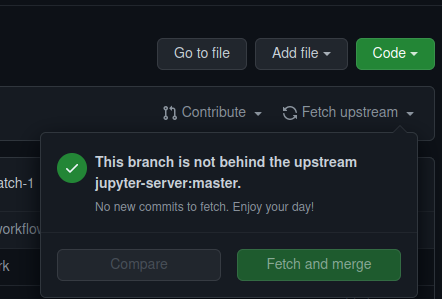
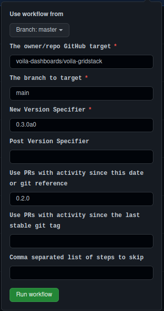

# Making a new release of Voilà GridStack

## Automated Releases with `jupyter_releaser`

The recommended way to make a release is to use
[`jupyter_releaser`](https://jupyter-releaser.readthedocs.io/en/latest/).

### Steps:

1. Clone [Jupyter Releaser](https://github.com/jupyter-server/jupyter_releaser) or make sure that your fork is up to date.

2. From your fork, run the action "Draft Changelog"

3. In the [Voila-Gridstack repo](https://github.com/voila-dashboards/voila-gridstack/pulls) you will see a new PR to update the changelog.
   Make sure the PR is correct and merge it.

4. From your fork, run the action "Full Release"

5. The most important part, make sure the released packages work as expected!
