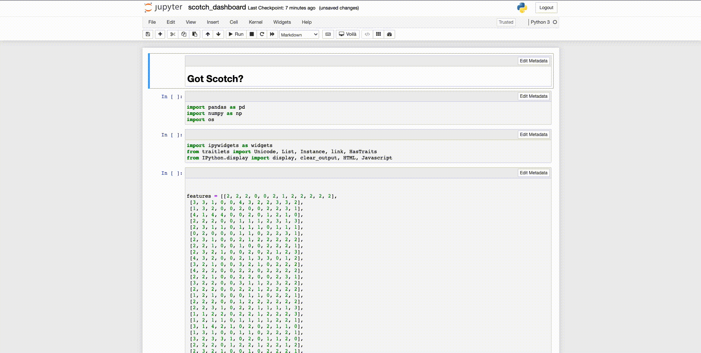

# Development

The Voila-Gridstack repository contains:

- A Voila template under the directory `voila_gridstack/template`
- A classic Notebook extension under the directory `voila_gridstack/nbextension`
- A JupyterLab extension in the root directory
- A server extension in `voila_gridstack/server_extension.py`
- And a Sphinx-base documentation under the directory `docs/`

The first step will be to create a conda environment that can be use as a development environment for the three extension.
After creating the environment and activating it, we can install the python package.

```bash
# create a new `conda` environment
micromamba create -n voila-gridstack -c conda-forge python nodejs=16 yarn notebook jupyterlab=3 voila ipywidgets

# activate the environment
micromamba activate voila-gridstack

# Optionally, install the packages used in the example notebooks
micromamba install -c conda-forge numpy pandas scipy ipympl bqplot seaborn

# install the package in development mode
pip install -e .[dev,test,docs]
```

## Template

To install the template from source, we need to follow the instructions described above to install the python package, and then we can link the local files for better development experience.

```bash
# link the local files
python scripts/develop.py --link

# start voila with the gridstack template
voila --template=gridstack
```

Then edit the files in `voila_gridstack/template` and reload the page to see the changes.

## Classic Notebook Extension



`voila-gridstack` provides an extension for the classic notebook to edit the gridstack layout from the notebook interface.

To install this extension in development mode, we need to follow the instructions described above to install the python package, and then we can link the local files for better development experience.

```bash
# link the local files
jupyter nbextension install --sys-prefix --symlink --overwrite --py voila_gridstack

# enable the extension
jupyter nbextension enable --sys-prefix --py voila_gridstack

# check the extension is installed and enabled
jupyter nbextension list

# start the notebook
jupyter notebook
```

Then edit the files in `voila_gridstack/nbextension` and reload the page to see the changes.

## JupyterLab Extension


`voila-gridstack` provides an extension for JupyterLab to edit the gridstack layout from lab's interface.

To install this extension in development mode, we need to follow the instructions described above to install the python package, and then we have to link the local files.

> Note: The `jlpm` command is JupyterLab's pinned version of
> [yarn](https://yarnpkg.com/) that is installed with JupyterLab. You may use
> `yarn` or `npm` in lieu of `jlpm` below.

```bash
# link your development version of the extension with JupyterLab
jupyter labextension develop . --overwrite

# rebuild extension TypeScript source after making changes
jlpm run build

# run JupyterLab in another terminal
jupyter lab
```

You can watch the source directory and run JupyterLab at the same time in different terminals to watch for changes in the extension's source and automatically rebuild the extension.

```bash
# Watch the source directory in one terminal, automatically rebuilding when needed
jlpm run watch

# Run JupyterLab in another terminal
jupyter lab
```

## Documentation

`voila-gridstack` provides documentation using sphinx deployed in read the docs [here](https://voila-gridstack.readthedocs.io).

To build the documentation, we need to follow the instructions described above to install the python package with the dependencies for building the documentation, and then we can build the documentation locally.

```bash
# build documentation
jlpm run build:docs
```

## Uninstall

```bash
# unlink the template's local files
python scripts/develop.py --unlink

# unlink the classic notebook extension files
jupyter nbextension uninstall --py voila_gridstack

# uninstall the python package
pip uninstall voila-gridstack
```
